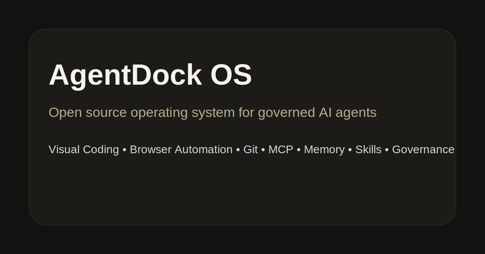
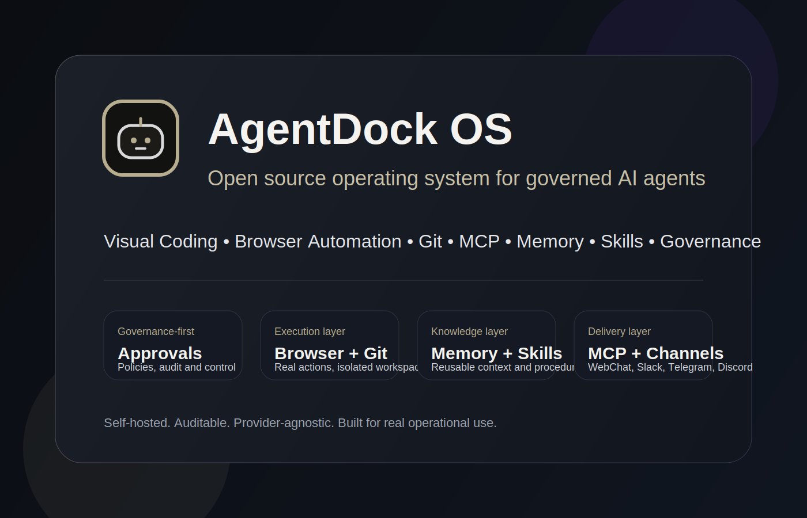

<p align="center">
  
</p>

<p align="center">
  
</p>

<p align="center">
  
</p>

<h1 align="center">AgentDock OS</h1>

<p align="center"><strong>Open source operating system for governed AI agents.</strong></p>

<p align="center">
  Self-hosted control plane for agents that work with code, browsers, Git, MCP, memory, skills, approvals, audit logs and cost policies.
</p>

<p align="center">
  
  
  
  
  
</p>

---

## What AgentDock OS is

AgentDock OS is a modular, self-hosted platform for teams that want AI agents to do real work without losing control of permissions, approvals, observability or infrastructure ownership.

It is built for developer teams, platform teams and open source operators who need agents that can inspect code, automate browsers, manage Git flows, register MCP servers, persist memory, reuse skills and interact through external channels.

## Why it exists

AI agents are moving from chat to action. Once they can edit files, run commands, open pull requests and talk to external systems, they need infrastructure that treats them like governed runtime identities, not unrestricted chatbots.

AgentDock OS provides that operational layer.

## What makes it different

- Self-hosted first.
- Governance by default.
- Human approval for sensitive actions.
- Provider-agnostic AI layer.
- MCP-native tool permissions.
- Audit logs for every relevant action.
- Cost tracking per agent, project and provider.
- Modular services that can evolve independently.

## Positioning vs alternatives

AgentDock OS is designed as a full operating system for governed agents, not only as a runtime, workflow engine or orchestration layer.

| Capability | AgentDock OS | Typical Hermes/OpenClaw-style tool |
|---|---|---|
| Web dashboard | Yes, productized | Often minimal or external |
| Agent governance | Policy-first, per agent/project | Usually partial or workflow-scoped |
| Approval engine | Native and explicit | Frequently custom-built |
| Audit log | Central and mandatory | Often fragmented |
| Cost tracking | Built in | Often absent or external |
| Browser runtime | Dedicated service with isolation | Usually not first-class |
| Git workspace | Worktree/branch-based, not mainline | Often ad hoc scripting |
| Memory engine | Persistent, scoped memory model | Usually limited context only |
| Skills engine | Versioned reusable procedures | Usually prompt templates |
| MCP Hub | Scoped tool permissions per agent | Often registry-level only |
| Message gateway | Multi-channel by design | Often not included |
| Deployment | Docker Compose + Dokploy | Varies by project |

Why that matters:

- You get a single control plane instead of a collection of disconnected automations.
- Sensitive actions can be approved, audited and reproduced.
- Teams can operate multiple agents with different permissions and budgets.
- The product is structured for public OSS adoption, not just internal experimentation.
- Browser, Git, MCP, memory, skills and governance are treated as first-class modules, not plugins glued on later.

In short: if you need a governed agent platform with real operational boundaries, AgentDock OS is the more complete foundation.

## What ships in this repository

| Layer | Included modules |
|---|---|
| Surface | Web dashboard, CLI and visual dev toolbar |
| Control plane | FastAPI API, auth, RBAC, governance, approvals, audit and costs |
| Execution | Agent runtime, browser runtime, gateway, worker and sandbox runner |
| Knowledge | Memory engine, skills engine and MCP Hub |
| Delivery | Git workspace, quality gate, provider layer and plugin SDK |
| Infra | Docker Compose, Dokploy Compose, healthchecks and persistent volumes |

## Core user journeys

1. Create an organization and project.
2. Invite members and assign roles.
3. Register a provider and test connectivity.
4. Create a governed agent with role, budget and limits.
5. Connect a repository and create an isolated worktree.
6. Create a task and assign it to an agent.
7. Run browser actions, Git changes and tool calls under policy.
8. Trigger quality gates before merge or apply.
9. Approve or reject sensitive actions.
10. Inspect audit logs and cost dashboards.

## Security and governance defaults

- No agent gets blanket access by default.
- `.env` is blocked unless explicitly allowed.
- Destructive commands require approval.
- Browser sessions use isolated profiles by default.
- MCP tools are permissioned per agent and project.
- File, command, browser and tool actions are policy-driven.
- Every sensitive event is auditable.
- Secrets are masked in logs and structured payloads.

## Architecture

```txt
Web / CLI / Toolbar / Channels
          |
          v
     AgentDock API
          |
  ---------------------------------------------
  |            |             |                |
Agent Runtime  Browser Runtime  Gateway  Worker/Sandbox
  |            |             |                |
Git Workspace  Playwright   Channels        Jobs/Tasks
  |
Quality Gate
  |
Audit Log + Cost Tracking + Approvals
```

## Supported providers

| Provider | Status |
|---|---|
| OpenAI | Supported |
| Anthropic | Supported |
| Gemini | Supported |
| Groq | Supported |
| OpenRouter | Supported |
| Ollama | Supported |
| LM Studio | Supported |

## Supported channels

| Channel | Status |
|---|---|
| WebChat | Native |
| Telegram | Supported |
| Discord | Supported |
| Slack | Supported |
| Email | Supported |
| Webhook | Supported |
| WhatsApp Cloud API | Future profile |

## Quickstart

```bash
git clone https://github.com/leadtunic/Agentdock-os.git
cd Agentdock-os
cp .env.example .env
docker compose up --build -d
```

Open:

```txt
Web:      http://localhost:3000
API:      http://localhost:8000
API Docs: http://localhost:8000/docs
```

## Local development

```bash
pnpm install
pnpm dev
```

Quality checks:

```bash
pnpm lint
pnpm typecheck
pnpm test
pnpm build
```

## Repository structure

```txt
apps/          Web dashboard, docs site and CLI
packages/      Shared packages, toolbar, SDK and protocol contracts
services/      API, runtimes, gateway, worker and execution services
plugins/       Built-in plugin manifests and plugin skeletons
docs/          Product, architecture, deployment, security and developer docs
infra/         Docker, Dokploy, Traefik, monitoring and infra references
.github/       CI, templates, CODEOWNERS and project automation
```

## Documentation

- [Product Specification](./SPEC.md)
- [Getting Started](./docs/getting-started.md)
- [Architecture Overview](./docs/architecture/overview.md)
- [System Design](./docs/architecture/system-design.md)
- [Security Model](./docs/architecture/security-model.md)
- [Docker Deployment](./docs/deployment/docker-compose.md)
- [Dokploy Deployment](./docs/deployment/dokploy.md)
- [Plugin SDK](./docs/plugin-sdk/overview.md)
- [Roadmap](./ROADMAP.md)

## Roadmap

The repository is structured around a public product evolution path:

- Repository foundation
- Core dashboard and API
- Agent runtime and tasks
- Git workspace and quality gates
- Visual toolbar
- Browser runtime
- Memory and skills
- MCP Hub
- Message gateway
- Production readiness

## Community and governance

- [Contributing](./CONTRIBUTING.md)
- [Code of Conduct](./CODE_OF_CONDUCT.md)
- [Security Policy](./SECURITY.md)
- [Governance](./GOVERNANCE.md)
- [Changelog](./CHANGELOG.md)
- [Adopters](./ADOPTERS.md)

## License

AgentDock OS is licensed under **AGPL-3.0-only**.
